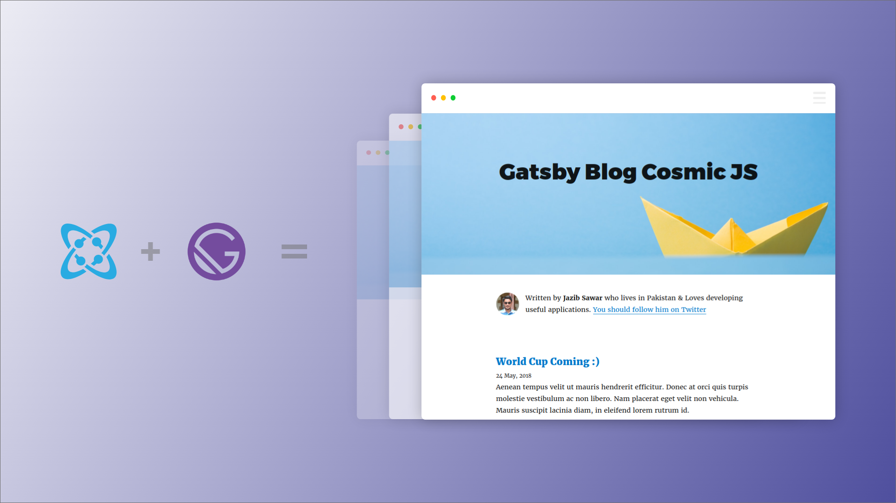

# Gatsby + Cosmic JS CMS Starter



> This repo contains an example blog website that is built with [Gatsby](https://www.gatsbyjs.org/), and [Cosmic JS](https://www.cosmicjs.com).

> [See live demo hosted on Netlify](https://gatsby-blog-cosmicjs.netlify.com/)

## Prerequisites

- Node (I recommend using v8.2.0 or higher)
- [Gatsby CLI](https://www.gatsbyjs.org/docs/)

## Install

``` bash
# Make sure that you have the Gatsby CLI program installed
npm install --global gatsby-cli

# run from your CLI
gatsby new gatsby-example-blog https://github.com/jazibsawar/gatsby-blog-cosmicjs
```
In `gatsby-config.js` you need to add configuration for Cosmic JS bucket

``` javascript
{
  resolve: 'gatsby-source-cosmicjs',
  options: {
    bucketSlug: '', /* bucket slug */
    objectTypes: ['posts'], /* object slugs you want to populate */
    apiAccess: {
      read_key: '', /* optional */
    }
  }
},
```

Then

``` bash
# Then you can run it by
cd gatsby-example-blog
npm run develop
```
